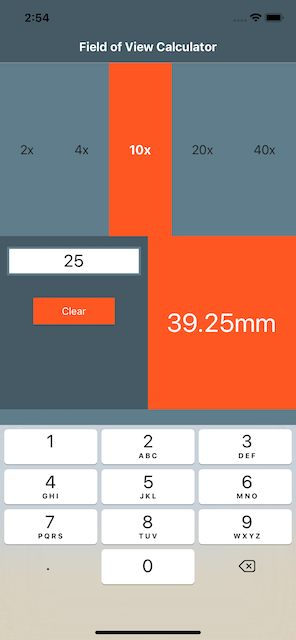
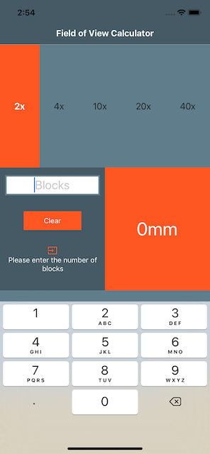
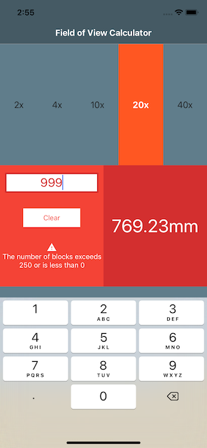

# field-of-view-calculator #

> A basic React Native app for calculating the block sizes for the field of view of a microscope

## Background ##

A microscope user asked me to create an application for their Android phone that would allow them to calculate the size of objects they can see in their microscope given the lens that they are using and the number of blocks the object measures.

```gherkin
As a microscope user
I want to quickly calculate the sizes of objects I can see in the microscope
So that I can record the size of objects
```

I used this opportunity to try [React Native](http://facebook.github.io/react-native/), as I had used [React](https://reactjs.org/) before and I am more comfortable with JavaScript than Java now.

I found that [Expo](https://expo.io/) was recommended for React Native development, so decided to use that too.

React Native suggests the use of [Flexbox](https://developer.mozilla.org/en-US/docs/Web/CSS/CSS_Flexible_Box_Layout/Basic_Concepts_of_Flexbox), a CSS layout that I was not familiar with, so I was able to learn a bit about that too. I found the [CSS-Tricks A Complete Guide to Flexbox](https://css-tricks.com/snippets/css/a-guide-to-flexbox/) very useful for this.

I had used [Redux](https://redux.js.org/) for managing state in React projects before and required dependent actions. In the past I had used [`redux-thunk`](https://github.com/reduxjs/redux-thunk), [`redux-on-state-change`](https://github.com/franjohn21/redux-on-state-change) and [`redux-saga`](https://redux-saga.js.org/) for more advanced Redux operations but decided to try [`redux-observable`](https://redux-observable.js.org/), a [RxJS](https://rxjs-dev.firebaseapp.com/) middleware for Redux, this time as I did not have experience of RxJS and wanted to try something new (plus it looked easier than sagas for my simple application!).

While selecting colors for the application I also learned a bit about [Google Material](https://material.io/design/) and recommended [color schemes](https://material.io/design/color/the-color-system.html) and [iconography](https://material.io/resources/icons/?style=baseline), though I didn't follow the full design system. I used [Material Design Palette](https://www.materialpalette.com/blue-grey/deep-orange) to come up with the colors and used the Google Material icons.

In summary, I used this exercise to learn about:

* [React Native](http://facebook.github.io/react-native/)
* [Expo](https://expo.io/)
* [Flexbox](https://developer.mozilla.org/en-US/docs/Web/CSS/CSS_Flexible_Box_Layout/Basic_Concepts_of_Flexbox)
* [Redux Observable](https://redux-observable.js.org/) / [RxJS](https://rxjs-dev.firebaseapp.com/)

## Application ##

The application has a single page; the calculator.

The top section is used to select the lens. The left section is used to enter the number of blocks. The right section shows the result of the calculation. The bottom is intentionally left empty to provide space for the keyboard.



A prompt appears when the number of blocks has not been entered.



A warning message appears when the number of blocks is outside the expected range of 0 to 250.



An error message appears when a non-numeric number of blocks is provided.


## Running ##

### Prerequisites ###

* [Node.js](https://nodejs.org/)
* [npm](https://www.npmjs.com/)

### Installing dependencies ###

From the `src` directory, run the `npm install`:

```console
npm install
```

## Running in Expo ###

Uses [Expo](https://expo.io/) to run:

From the `src` directory, run the `start` script:

```console
npm start
```

You can now use the

## Building ##

> This is [the next thing](https://docs.expo.io/versions/v36.0.0/distribution/building-standalone-apps/) to learn!
